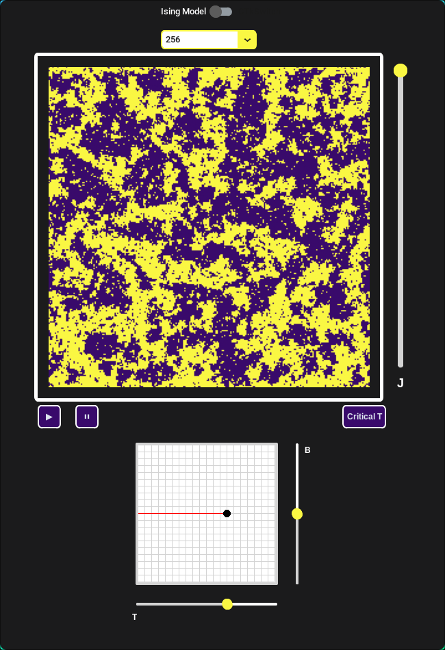
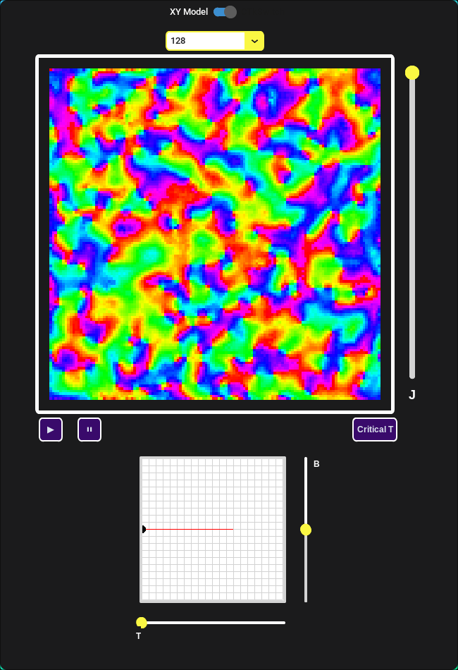

# Ising-Model-GUI

An application simulating 2D discrete spin behaviour of a lattice in the presence of a magnetic field via the Ising Model. The application provides an interactive (Temperature, Magnetic Field Strength) phase diagram for the user to traverse through to observe phase transitions and critical behaviour.

# Buiding the Application
**Languages & Packages:** Python using the packages NumPy, Matplotlib, Tkinter, CustomTkinter   
  

The application uses the Metropolis-Hasting Algorithm, referred to as a Markov Chain Monte Carlo (MCMC) sampling method.   
The method involves initialising a configuration of the spin (represented by -1,1) lattice and making random changes that are energetically favourable or follow the Boltzmann distribution for the model. The Metropolis-Hasting algorithm is packaged in the file Metro_Algo.py.   
  
The GUI is created using customtkinter with tkinter variables to create custom widget objects (i.e. Phase Diagram Widget, Ising Model Display Widget, etc.). The GUI provides sliders to adjust values such as *J* (the interaction strength) *B* (magnetic field strength), *T* (Temperature). The grid is a (T,B)-phase diagram that has an interactive drag-and-drop style pointer to traverse the Ising model different phases of the Ising model, with indications (red line) of the critical line and critical point at *T = 2.26* for *J = 1*. The Model display uses matplotlib's FigureCanvas to create a tkinter widget.
  
Executing the GUI.py file with the Metro_Algo.py package runs the application.

# Extensions to the XY Model
The XY-Model models 2D *continuous* spin behaviour of a lattice in the presence of a magnetic field, such a model would describe materials such as a 2D ferromagnet. Such materials do not undergo phase transitions but at low temperatures *T = 0* phenomena such as votices/anti-vortices can be observed. A similar MCMC sampling method can be used with minor alterations to simulate such a system. These alterations has been incorporated into the Metro_Algo.py.   
  
The GUI has a switch to swap between the Ising Model and XY Model with the rainbow heatmap indicating the spin rotation value at each lattice point (red = 0 rad). At low temperatures vortices can be observed where all colours meet.

